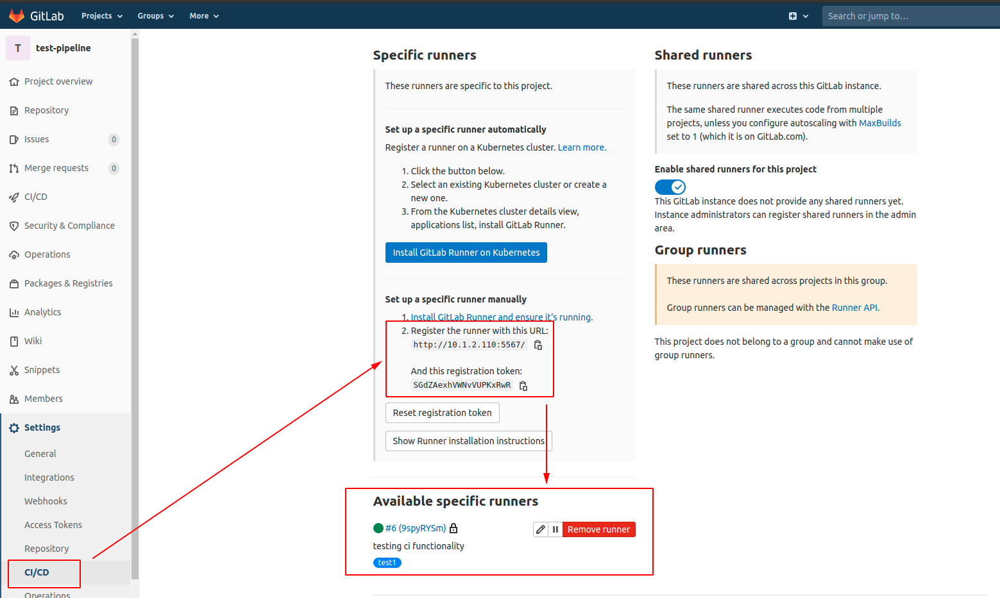
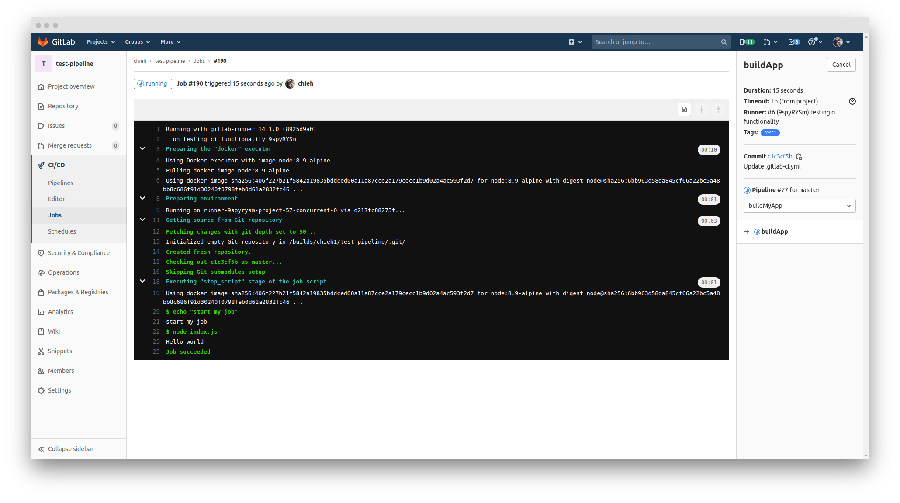
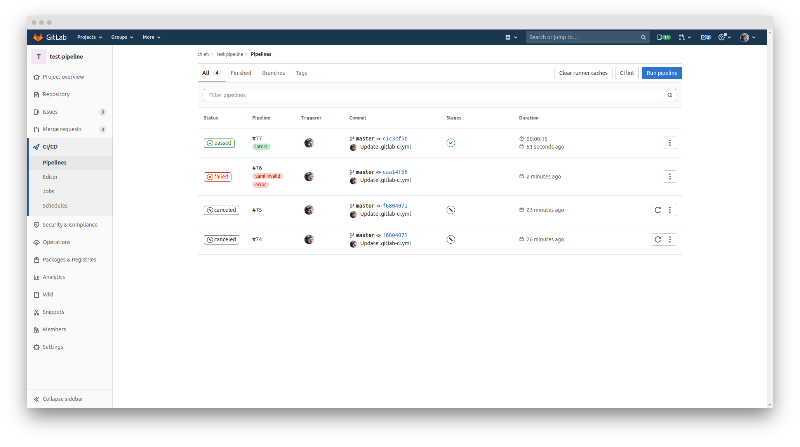

# Gitlab Pipeline

## Introduction

**Workflow:**
1. Mainly we can separate two parts that first part is creating runner and set up runner. 
2. Second part is to write the CI script like defining your testing workflow.

**Note:**
1. Gitlab server and Gitlab runner can be set in different devices.
2. Gitlab runner can support various OS versions including Linux, MacOS, WIN, etc. [Documents](https://docs.gitlab.com/runner/install/)
3. If my device is using linux, you can only use linux runner and you cannot use WIN runner.

## Steps

1. Create a runner.

Please define the location of your config. 
```
docker run --rm -t -i -v /path/to/config:/etc/gitlab-runner --name gitlab-runner gitlab/gitlab-runner register
```

Here is my example.


Check the "Set up a specific runner manually" area.

```
$ docker run --rm -t -i -v /test-pipeline/config:/etc/gitlab-runner --name gitlab-runner gitlab/gitlab-runner register

Runtime platform                                    arch=amd64 os=linux pid=6 revision=8925d9a0 version=14.1.0
Running in system-mode.                            
                                                   
Enter the GitLab instance URL (for example, https://gitlab.com/):
http://10.1.2.110:5567/
Enter the registration token:
SGdZAexhVWNvVUPKxRwR
Enter a description for the runner:
[aa8c8bee8ea6]: testing ci functionality
Enter tags for the runner (comma-separated):
test1
Registering runner... succeeded                     runner=SGdZAexh
Enter an executor: custom, docker, parallels, shell, ssh, docker+machine, docker-ssh, virtualbox, docker-ssh+machine, kubernetes:
docker
Enter the default Docker image (for example, ruby:2.6):
node:8.9-alpine
Runner registered successfully. Feel free to start it, but if it's running already the config should be automatically reloaded! 
```

Done of registered runner only, and then let's start the runner.

Please change your path of config folder.
```
test-pipeline ›› docker run -d --name gitlab-runner --restart always \   
-v /test-pipeline/config:/etc/gitlab-runner \ 
-v /var/run/docker.sock:/var/run/docker.sock \
gitlab/gitlab-runner:latest
d217fc88273f841a9743f97056468c3cc6f91d0d7f5f91d1dee2fd0ceec0bb3d
```
Let's go back to Gitlab repo page that we can see there is a runner.


Done of setting the runner.

Second part is to create a script for gitlab-ci use. 
You can define exact commands inside this script.

2. Create a `.gitlab-ci.yaml` script:
```
image: node:8.9-alpine

stages:
    - buildMyApp
    
buildApp:
    stage: buildMyApp
    tags: 
        - test1
    script:
        - echo "start my job"
        - node index.js
```
(If you create this scirpt in host, then you add this script and commit & push it.)
Then we can go to **CI/CD** area to run pipeline.
We can click it and check in the **job** to see the whole processes.


After it finishes successfully, it will show the *passed* on the status of pipelines.


If your gitlab-ci.yaml format wrong, you can go to **CI lint** of the pipelines page to validate the format.


## Reference

1. [[教學] 如何使用Gitlab CI來達到自動化測試與佈署](https://xenby.com/b/178-%E6%95%99%E5%AD%B8-%E5%A6%82%E4%BD%95%E4%BD%BF%E7%94%A8gitlab-ci%E4%BE%86%E9%81%94%E5%88%B0%E8%87%AA%E5%8B%95%E5%8C%96%E6%B8%AC%E8%A9%A6%E8%88%87%E4%BD%88%E7%BD%B2)
2. [[簡易教學] 五分鐘內學會使用Gitlab Pipeline作CI](http://andy51002000.blogspot.com/2019/11/gitlabcicd.html)